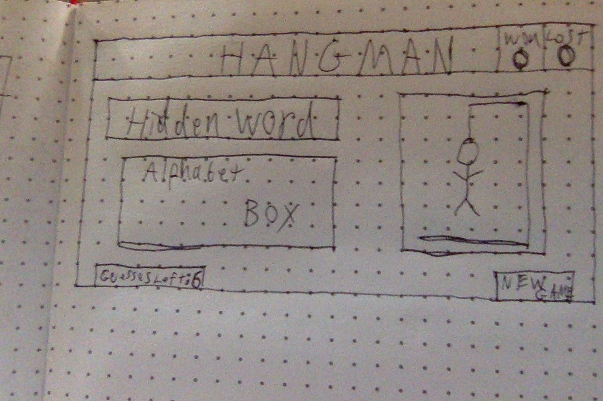

# Hangman Project
### Overview

For the first project I chose to do a "Hangman" style game with a western theme.

The player will click a letter from the alphabet box. If the letter is in the hidden word it will be displayed in each place it occurs. If it is incorrect the letter will fade and an incorrect guess counter will decrease by 1. Guesses will continue until the word is complete or 6 incorrect guesses have been used.

[Play Hangman!](http://twmcdonaldhangman.bitballoon.com "Play Hangman!")

### Technologies Used

* jQuery
* CSS
* HTML
* User Stories - [Trello](https://trello.com/b/mAEvMb76/project-1 "Trello")

### Features
* Western theme
* Random words
* Guess counter
* Reset/randomize at game end

### Wireframe

### Future Development
* Improve responsiveness
* Light animation
* Win/loss counter
* Provide non-alert feedback
* Optional western music
* Optional sound effects